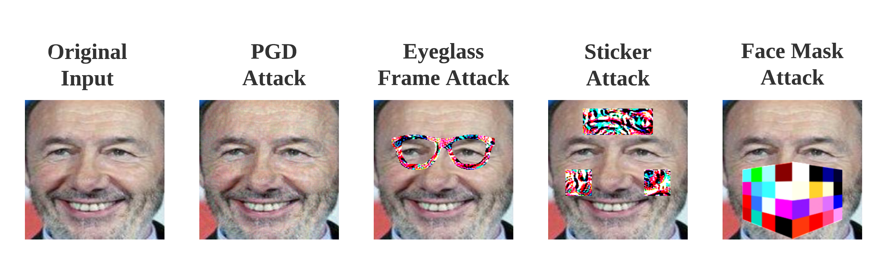

# FaceSec: A Fine-grained Robustness Evaluation Framework for Face Recognition Systems

Corresponding code to the paper "FACESEC: A Fine-grained Robustness Evaluation Framework for Face Recognition Systems" at CVPR 2021 ([PDF](https://arxiv.org/pdf/2104.04107.pdf)).

## Environment and prerequisites
Before getting started, we recommend using Python 3 (>=3.6.7) throughout the experiments. In addition, the following packages are required.
* CUDA. Version 10.1 is recommended.
* cuDNN. Version 7.6.5 is recommended.
* [PyTorch (GPU version)](https://pytorch.org/get-started/locally/). Version 1.7 is recommended.
* [Torchfile](https://pypi.org/project/torchfile/)
* [Requests](https://pypi.org/project/requests/)
* [Kornia](https://github.com/kornia/kornia): PyTorch implementations for differentiable transformations in computer vision. Version 0.2.0 is recommended.
* [PyMTCNN](https://github.com/timesler/facenet-pytorch#guide-to-mtcnn-in-facenet-pytorch): Pytorch implementation for MTCNN, a library to detect and crop human faces in photos.
* Numpy
* Matplotlib

## Directory layout
```
root
|-- README.md | This file.
|-- architecture | Pytorch implementation of the neural architecture of the face recognition system to be evaluated.
|   |-- vggface.py | Implementation of VGGFace.
|   |-- facenet.py | Implementation of FaceNet.  
|-- data | Test data used in experiments. 
|   |-- gallery | Image folder for the gallery set (only applicable for open-set face recognition).
|   |-- test | Image folder for the test set (applicable for both closed- and open-set systems).
|-- mask | Masks that indicates face area in which occlusion can be added.
|   |-- eyeglass.png | Mask for the eyeglass frame attack.
|   |-- facemask.png | Mask for the grid-level face mask attack.
|   |-- sticker | Mask for the sticker attack on the face.  
|-- model | Directory to save trained models.
|   |-- vggface_closed.pt | PyTorch model for closed-set VGGFace (neural weights of open-set is automatically loaded in its initialization).
|   |-- pretrained_vggface.t7 | Weights of the original VGGGFace neural networks (torch version). 
|   |-- facenet_closed.pt | PyTorch model for closed-set FaceNet (neural weights of open-set is automatically loaded in its initialization).
|-- attack.py | Implementations of attacks used in robustness assessment.
|-- config.py | Configuration file of experiments. Needs to be modified when customizing your evaluations.
|-- data.py | Helper functions to process dataset.
|-- face_recognition.py | Implementation of FaceSec.
|-- utils.py | Helper functions to load and compute matrices used in evaluations.
|-- attack_method.png | Examples of attack methods implemented in FaceSec.
|-- robust_evaluation.py | Main entry of robust assessment experiments.
```

## Robust evaluation
Our toolkit contains the following four attack methods to assess security of a given face recognition system, and you can use ```-a``` option of ```robust_evaluation.py``` to choose which attack in your evaluation: 1) [PGD attack](https://arxiv.org/pdf/1706.06083.pdf), a ```digital attack``` which adds small perturbations on the entire image; 2) [eyeglass frame attack](https://dl.acm.org/doi/pdf/10.1145/2976749.2978392), a ```physically realizable attacks``` that adds eyeglass frame on the face of photos; 3) Sticker attack, which adds adversarial stickers on the forehead and each side of the face; 4) Grid-level face mask attack, which adds a face mask of color grids on the face of people. These attack methods are demonstrated in the following figure.


Some example scripts of how to run the toolkit:
```
$ python robust_evaluation.py -h
usage: robust_evaluation.py [-h] [-s SOURCE] [-t TARGET] [-m MODE] [-a ATTACK]
                            [-u [UNIVERSAL]] [-i INPUT] [-o OUTPUT]
                            [-g GALLERY]

optional arguments:
  -h, --help            show this help message and exit
  -s SOURCE, --source SOURCE
                        Source model name to be evaluated.
  -t TARGET, --target TARGET
                        Target model name to be evaluated (used in black-box
                        attacks).
  -m MODE, --mode MODE  Mode of face recognition. Can be one of [closed,
                        open].
  -a ATTACK, --attack ATTACK
                        Attack mothod Can be one of [pgd, sticker, eyeglass,
                        facemask].
  -u [UNIVERSAL], --universal [UNIVERSAL]
                        Whether to produce universal adversarial examples.
  -i INPUT, --input INPUT
                        Directory of input test images.
  -o OUTPUT, --output OUTPUT
                        Directory of output adversarial examples.
  -g GALLERY, --gallery GALLERY
                        Directory of gallery images (ONLY and MUST for open-
                        set).

```

An example script to use ```white-box``` ```sticker attacks``` on ```closed-set``` VGGFace.
```
$ python robust_evaluation.py \
    -s vggface \
    -m closed \
    -a sticker \
    -i data/test \
    -o data/closed_sticker_vggface
```
After running the scripts above, the resulting adversarial examples will be stored in ```data/closed_sticker_vggface```, and the robustness of vggface against sticker attacks will be printed out.

An example script to use ```white-box``` sticker attacks on ```open-set``` VGGFace, then use the resulting adversarial examples to evaluate the robustness of ```open-set``` FaceNet. 
```
$ python robust_evaluation.py \
    -s vggface \
    -t facenet \
    -m open \
    -a sticker \
    -i data/test \
    -o data/open_sticker_vggface \
    -g data/gallery
```
This is also called ```black-box attack``` or ```transfer attack``` on FaceNet, where VGGFace is called the ```source model``` and FaceNet the ```target model```. Note that if the adversairal examples have been produced and stored in the output directory, then this script will directly produce black-box attacks without performing white-box attacks twice.

## Closed-set and open-set face recognition
Our toolkit support both closed-set and open-set face recognition. The difference between the two lies in whether test IDs appear in the training set. Basically, closed-set face recognition contains exactly the same face IDs in the training and test set, and most work focuses on ```identification``` by using typical classification. By contrast, for open-set face recognition, training IDs and test IDs are not necessarily the same, and most work focuses on ```verification``` by solving a metric learning problem. Details of the differences are described in [this paper](https://openaccess.thecvf.com/content_cvpr_2017/papers/Liu_SphereFace_Deep_Hypersphere_CVPR_2017_paper.pdf) (see its Figure 1).

## Individual and universal attack
Additionally, FaceSec supports both individual and universal attacks: the former produces a specific perturbation for each test data, while the latter produces a universal perturbation for a batch of test data. To explicitly control the ```universality``` of attacks, one can set the ```-u``` option in ```main.py``` as ```True``` and edit the value of ```batch_size``` in ```config.py```.

## Use new datasets and face recognition models
Adding more datasets and face recognition models to FaceSec is trivial.
1. Add your own dataset. For closed-set face recognition, a test set should be included; for open-set face recognition, both test and gallery set should be included. Moreover, these datasets should be first processed by MTCNN described above. Specifically, you should use MTCNN to detect and crop faces into 224*224 images with RGB channels. Note that the margin should be set to be 0.
2. Add the implementation of your neural architecture in ```./architecture```. Note that you may add a resize layer and a normalized layer (see details in ```./architecture/vggface.py```, note that the input images has [0,1] scale after using our data loader).
3. Import your method in ```face_recognition.py``` and edit the ```load_model``` function.

## Citation
```
@inproceedings{tong2021facesec,
  title={FACESEC: A Fine-grained Robustness Evaluation Framework for Face Recognition Systems},
  author={Tong, Liang and Chen, Zhengzhang and Ni, Jingchao and Cheng, Wei and Song, Dongjin and Chen, Haifeng and Vorobeychik, Yevgeniy},
  booktitle={IEEE/CVF Conference on Computer Vision and Pattern Recognition},
  year={2021}
}
```

## Contact
* Liang Tong (liangtong39@gmail.com)
